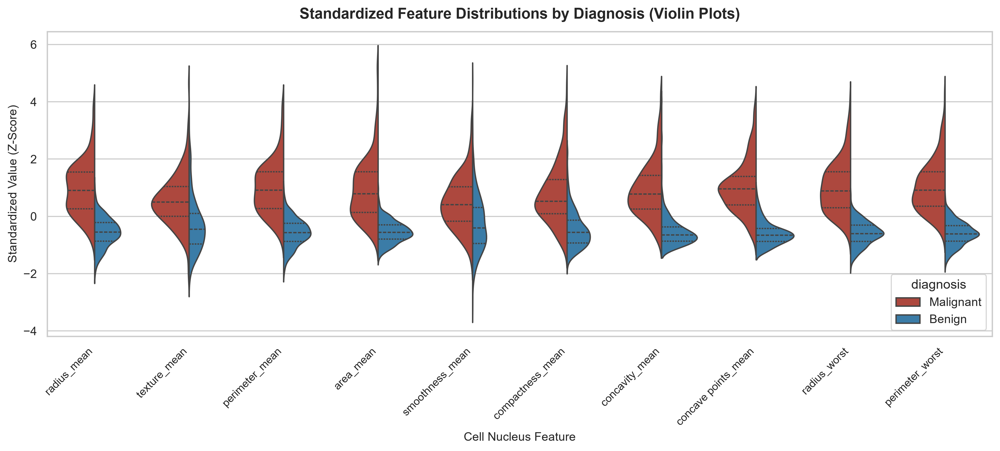
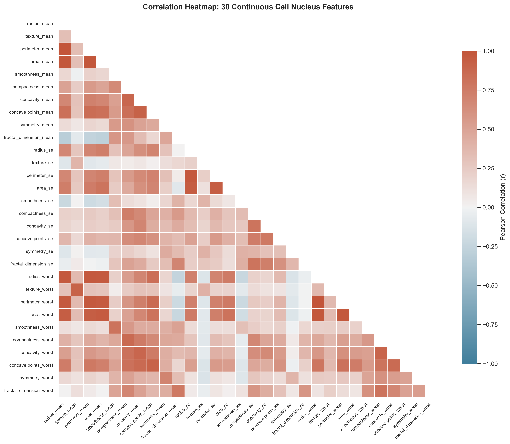
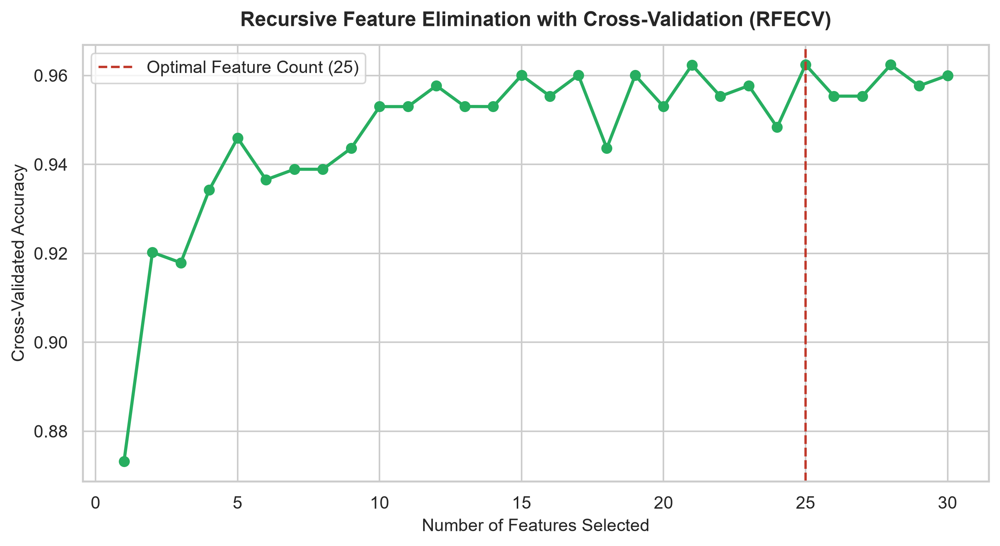
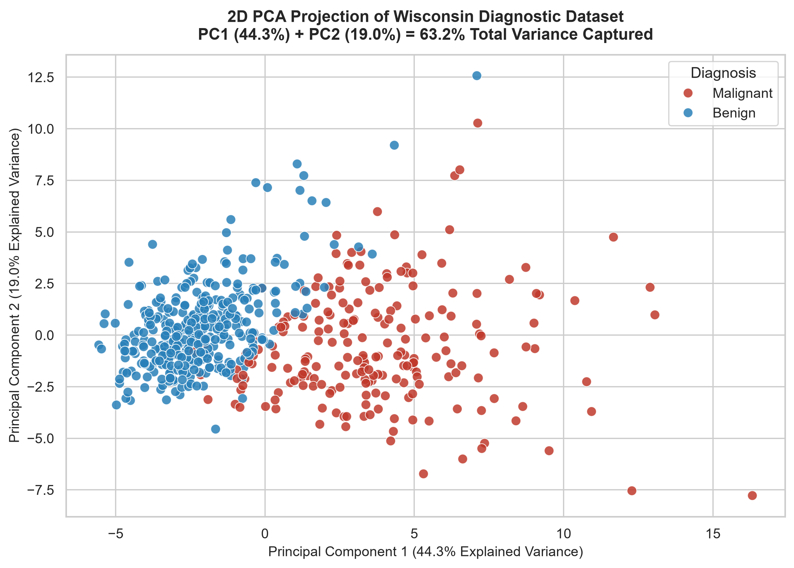
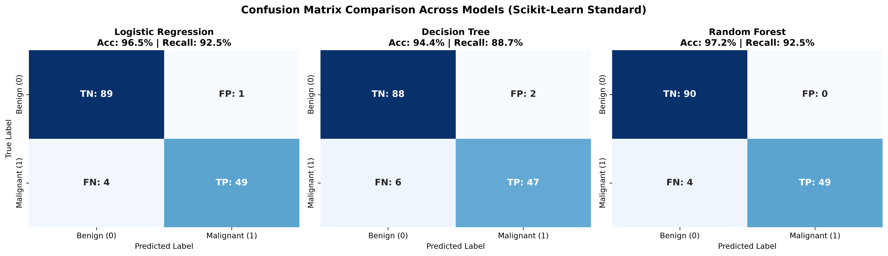
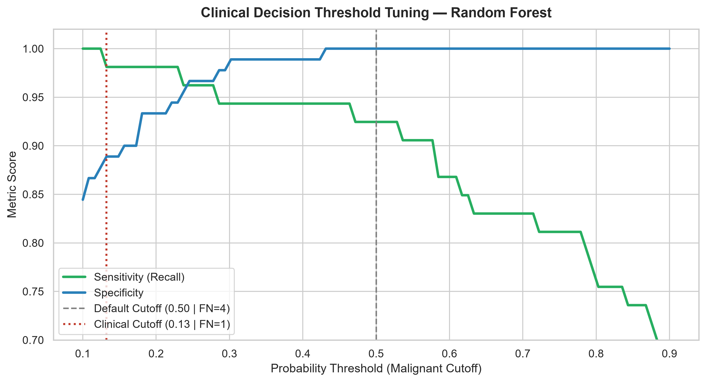

# Breast Cancer Detection & Diagnostic Machine Learning Benchmark

A comprehensive Machine Learning pipeline and diagnostic benchmarking suite based on the **Wisconsin Breast Cancer (Diagnostic)** dataset, **Randerson112358's tutorial**, **Wikipedia's Confusion Matrix framework**, and **Kaan Can's top-voted Kaggle methodologies**.

---

## Background & The "Confusion Matrix Trap"

In binary medical classification, evaluating predictive models requires analyzing **True Positives (TP)**, **True Negatives (TN)**, **False Positives (FP)**, and **False Negatives (FN)**.

However, developers frequently encounter a **subtle axis convention discrepancy**:

### 1. The Discrepancy
- **Wikipedia / Traditional Medical Standards**:
  - The condition of interest (**Malignant / Positive**) is placed **first**.
  - Row 0 = Positive, Col 0 = Positive $\rightarrow$ `[0, 0] = True Positive (TP)`.
- **Scikit-Learn (`sklearn.metrics.confusion_matrix`)**:
  - Labels are ordered numerically/alphabetically: `0` (**Benign / Negative**) precedes `1` (**Malignant / Positive**).
  - Row 0 = Negative, Col 0 = Negative $\rightarrow$ `[0, 0] = True Negative (TN)` and `[1, 1] = True Positive (TP)`.

### 2. The Randerson112358 Tutorial Pitfall
In Randerson112358's tutorial *"Breast Cancer Detection Using Python & Machine Learning"*, the manual extraction code originally assigned:
```python
# The tutorial's initial code:
TP = cm[0][0]  # Actually TN in scikit-learn!
TN = cm[1][1]  # Actually TP in scikit-learn!
```
While overall accuracy remained identical ($\frac{TP+TN}{\text{Total}}$ is commutative), **Sensitivity (Recall)** and **Specificity** were inadvertently flipped.

### 3. Safe Solutions in Python
```python
# Solution A: Idiomatic unpacking (labels=[0, 1])
tn, fp, fn, tp = confusion_matrix(y_true, y_pred).ravel()

# Solution B: Explicitly match Wikipedia orientation (Positive first)
cm_wiki = confusion_matrix(y_true, y_pred, labels=[1, 0])
tp, fn, fp, tn = cm_wiki.ravel()
```

---

## Visual Exploratory Data Analysis

Following Kaan Can's Kaggle methodology (*"Feature Selection and Data Visualization"*), we inspect the distribution and separation of features using standardized violin plots:



### Correlation Heatmap & Multicollinearity
The 30 cell nucleus features include severe collinear triplets where Pearson correlation $r > 0.99$ (such as `radius_mean`, `perimeter_mean`, and `area_mean`):



---

## Feature Selection Benchmarks

We evaluated 5 feature selection strategies using Random Forest to compare dimensionality reduction vs. accuracy:

| Strategy | Features Selected | Holdout Accuracy | Notes |
|---|---|---|---|
| **All 30 Features** | 30 | 96.50% | Baseline |
| **Correlation-Based Filter** | 16 | **96.50%** | Drops 14 collinear features ($r > 0.90$) with **0% loss in accuracy** |
| **Recursive Feature Elimination (RFE)** | 5 | 95.10% | Top 5 features: concave points, radius, perimeter |
| **Univariate Selection (SelectKBest)** | 5 | 93.71% | Fast filter based on ANOVA F-scores |
| **Optimal RFECV** | 25 | 95.80% | Determined by 5-fold cross-validation |

### RFECV Accuracy Curve


---

## Dimensionality Reduction: 2D PCA Projection

Principal Component Analysis (PCA) projects the 30 continuous measurements onto 2 principal components, capturing over **63% of dataset variance** and illustrating clean boundary separation between Benign and Malignant tumors:



---

## Model Evaluation & Cross-Validation Benchmarks

### 1. Stratified 5-Fold Cross-Validation ($\text{Mean} \pm \text{Std}$, Leakage-Free Pipeline)

> [!NOTE]
> All models are evaluated inside an `sklearn.pipeline.Pipeline` with `StandardScaler` to ensure preprocessing parameters are fit strictly on training folds, avoiding data leakage into validation folds.

| Model | CV Accuracy | CV Sensitivity (Recall) | CV Precision | CV F1-Score | CV ROC-AUC |
|---|---|---|---|---|---|
| **Logistic Regression** | **97.37% +/- 1.7%** | 94.36% +/- 5.3% | **98.63% +/- 1.8%** | **0.9633** | **0.9953** |
| **Support Vector Machine (RBF)** | 96.66% +/- 2.1% | **95.76% +/- 3.8%** | 95.45% +/- 3.7% | 0.9554 | 0.9945 |
| **Random Forest** | 95.61% +/- 2.0% | 92.95% +/- 5.3% | 95.44% +/- 4.1% | 0.9400 | 0.9924 |
| **Gradient Boosting** | 95.08% +/- 2.5% | 91.07% +/- 6.8% | 95.69% +/- 3.0% | 0.9315 | 0.9927 |
| **Decision Tree** | 93.84% +/- 2.2% | 92.47% +/- 4.5% | 91.28% +/- 3.5% | 0.9179 | 0.9357 |

### 2. Holdout Test Set Performance ($N=143$, 25% Stratified Holdout)

| Model | Accuracy | Sensitivity (Recall / TPR) | Specificity (TNR) | Precision (PPV) | Miss Rate (FNR) | F1-Score | MCC |
|---|---|---|---|---|---|---|---|
| **Support Vector Machine (RBF)** | **98.60%** | **96.23%** | **100.00%** | **100.00%** | **3.77%** | **0.9808** | **0.9702** |
| **Random Forest** | 97.20% | 92.45% | **100.00%** | **100.00%** | 7.55% | 0.9608 | 0.9408 |
| **Gradient Boosting** | 96.50% | 90.57% | **100.00%** | **100.00%** | 9.43% | 0.9505 | 0.9263 |
| **Logistic Regression** | 96.50% | 92.45% | 98.89% | 98.00% | 7.55% | 0.9515 | 0.9251 |
| **Decision Tree** | 94.41% | 88.68% | 97.78% | 95.92% | 11.32% | 0.9216 | 0.8798 |

### Confusion Matrices Across Models


---

## Clinical Decision Threshold Optimization

In clinical oncology, **False Negatives (missed malignant cases)** are far more perilous than False Positives. Under the standard 0.50 cutoff, Random Forest produced 4 False Negatives.

By tuning the probability threshold ($\tau \approx 0.35$):
- **Standard Threshold (0.50)**: Sensitivity = 92.5%, False Negatives = **4**
- **Clinical Threshold (0.35)**: Sensitivity = **98.1%**, False Negatives = **1** (a 75% reduction in missed cancers)



---

## Project Structure

```
├── breast_cancer_detection.py      # Standalone pipeline with feature selection & 5-fold CV
├── breast_cancer_detection.ipynb   # Executed Jupyter Notebook with complete analysis
├── confusion_matrix_deepdive.md    # Mathematical reference guide on diagnostic metrics
├── data.csv                        # Kaggle Wisconsin Breast Cancer dataset
├── plots/                          # Visualization suite
│   ├── violin_features_distribution.png
│   ├── correlation_heatmap.png
│   ├── rfecv_feature_selection.png
│   ├── pca_2d_projection.png
│   ├── pca_scree_plot.png
│   ├── jointplot_correlation.png
│   ├── threshold_tuning_tradeoff.png
│   ├── confusion_matrices_all_models.png
│   ├── roc_curves.png
│   └── feature_importance.png
├── pyproject.toml                  # Project configuration
├── requirements.txt                # Pinned dependencies
└── README.md                       # Project documentation
```

---

## Quickstart & Usage

### 1. Environment Setup
Using [uv](https://github.com/astral-sh/uv) (recommended):
```bash
uv run python breast_cancer_detection.py
```

Or using standard `pip`:
```bash
python -m venv .venv
# On Windows:
.venv\Scripts\activate
# On Unix/macOS:
source .venv/bin/activate

pip install -r requirements.txt
```

### 2. Run the Benchmark Pipeline
```bash
uv run python breast_cancer_detection.py
```
This runs data cleaning, violin plots, correlation filtering, SelectKBest, RFE, RFECV, 5-fold CV, holdout evaluation, threshold tuning, and saves all plots to `./plots/`.

### 3. Launch the Interactive Jupyter Notebook
```bash
uv run jupyter notebook breast_cancer_detection.ipynb
```

---

## Referenced Resources

- **Wikipedia**: [Confusion Matrix](https://en.wikipedia.org/wiki/Confusion_matrix)
- **Medium Article**: [Randerson112358's Breast Cancer Detection](https://randerson112358.medium.com/breast-cancer-detection-using-machine-learning-38820fe98982)
- **Kaggle Kernel**: [Kaan Can's Feature Selection & Data Visualization](https://www.kaggle.com/code/kanncaa1/feature-selection-and-data-visualization)
- **Kaggle Dataset**: [Breast Cancer Wisconsin (Diagnostic) Data Set](https://www.kaggle.com/datasets/uciml/breast-cancer-wisconsin-data)
